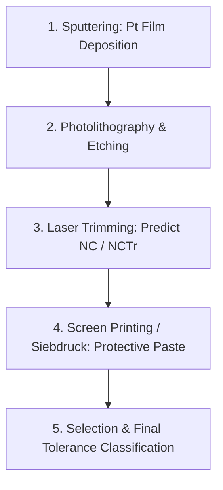

# JUMO Laser Trimming Support System: Project Overview

## 1. Executive Summary

This project delivers an end-to-end, machine learning-driven decision support system designed to optimize the laser trimming process in platinum thin-film resistance temperature detector (Pt RTD / PRT) production at **JUMO GmbH & Co. KG**. 

Developed in compliance with the **VDE SPEC 90012** framework for *Trustworthy AI* and transparency requirements under the **EU AI Act**, the system predicts optimal **Nominal Value Correction ($NCTr$)** values and expected **Yield Distributions** per tolerance class prior to laser trimming.

### Key Performance Highlights
- **Prediction Accuracy**: Reached an **RMSE of 0.0202** and an **$R^2$ of 0.9492** for $NCTr$ regression.
- **Tolerance Compliance**: **99.63%** of all model predictions fall within the strict $\pm 0.1$ resistance tolerance limit.
- **Yield Prediction**: Achieved **94.52% accuracy** (weighted F1-score: **0.9440**) for final tolerance selection class forecasting.
- **EU AI Act Transparency**: Built-in model version traceability (`model_version` linked to MLflow run IDs), audit history logging, and automated AI transparency disclaimers.

---

## 2. Industrial Context & Production Flow

Platinum thin-film sensors are manufactured through a multi-stage physical and chemical production chain:

1. **Sputtering**: High-purity platinum thin films are deposited onto ceramic substrates using sputtering machines.
2. **Photolithography & Etching**: Resistor meander patterns are etched into the platinum layer.
3. **Laser Trimming**: Lasers cut specific meander loops to adjust initial electrical resistance ($R_{20}$). The system must recommend a **Nominal Correction ($NC$)** value to compensate for downstream manufacturing shifts.
4. **Screen Printing (*Siebdruck*)**: Protective glass/ceramic pastes are applied and fired onto the trimmed sensors.
5. **Selection & Testing**: Finished sensors are measured and sorted into standardized tolerance classes (e.g., **F 0.1**, **F 0.15**, **F 0.3** according to IEC 60751).

---

## 3. Core Technical & Industrial Challenges

### Challenge 1: Sputtering Machine Shift (Senvac vs. FHR)
In late 2018, JUMO transitioned from legacy **Senvac** sputtering machines to modern **FHR** equipment.
- **Senvac**: Layer thickness controlled by sputter duration (`Sputter_Zeit`). TCR influenced by oxygen flow (`O2Process`) and annealing (`Tempern`).
- **FHR**: Layer thickness controlled by cycle count (`Zyklen`).
- **Solution**: Raw machine-specific parameters are mapped into normalized physical feature representations (`schichtdicke`, `schichtwiderstand`, `target` TCR), enabling a single unified model to operate across all substrate batches regardless of machine origin.

### Challenge 2: The Screen Printing Paste Logistical Constraint
Screen printing paste (applied *after* laser trimming) exerts a significant thermal and chemical shift on sensor resistance. However, **the exact paste lot to be used is not known at the moment the NC value is set at the laser table**.
- **Solution**: The pipeline incorporates **rolling historical lag features** (`lag_mean_tk_n_avg_5`, `lag_mean_r0_shift_5`) computed across recent finished production orders of the same sensor group, combined with ambient cleanroom humidity (`air_humidity`) and viscosity defaults.

### Challenge 3: Multi-Step Laser Trimming & Target Realignment ($NCTr$)
Sensors can undergo optional coarse/fine trimming steps ($NT$ step vs. standard single trim). Initial baseline models trained on generic raw correction fields produced higher errors.
- **Solution**: We realigned the training target chronologically to **$NCTr$**, taking the final measurement before leaving the cleanroom:
  $$NCTr = N\_NOMINALVALUECORRECTION \longrightarrow NT\_NOMINALVALUECORRECTION \longrightarrow NOMINALVALUECORRECTION$$
  This target realignment reduced regression RMSE from **0.1044** down to **0.0202**.

---

## 4. Live Cloud Deployment Endpoints

The complete application is hosted live on **Microsoft Azure**:

- **Backend API (Azure Container Apps)**:  
  [https://jumo-backend-api.nicedune-7d6d11ba.eastus.azurecontainerapps.io/health](https://jumo-backend-api.nicedune-7d6d11ba.eastus.azurecontainerapps.io/health)
- **Frontend Client (Azure Static Web Apps)**:  
  [https://orange-water-0d895060f.7.azurestaticapps.net/](https://orange-water-0d895060f.7.azurestaticapps.net/)
