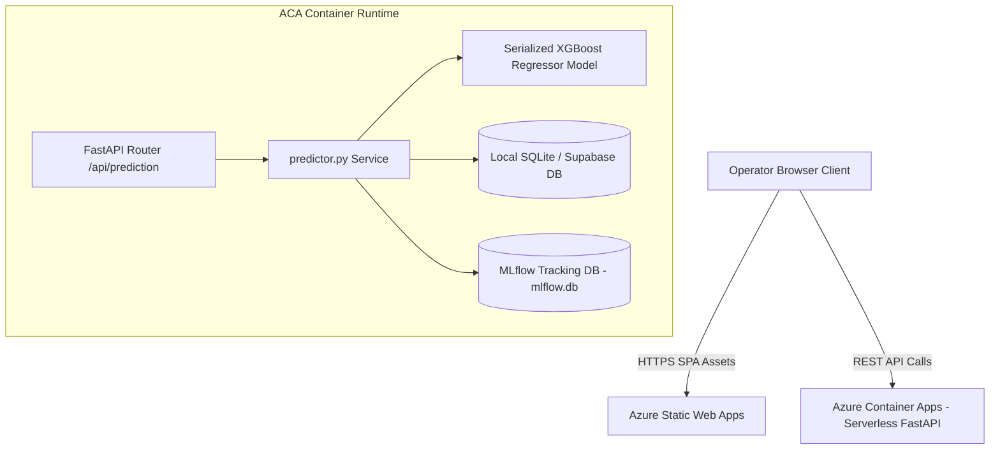

# System Architecture & Cloud Deployment Guide

## 1. High-Level Architecture Overview

The system utilizes a decoupled microservices architecture designed for serverless scalability, low latency, and zero-downtime deployments.



---

## 2. Technology Stack

| Layer | Component | Technology / Framework |
|---|---|---|
| **Frontend UI** | Client Application | React 18, Vite, TailwindCSS v4 |
| **Typography & Styling** | User Experience | Plus Jakarta Sans, Outfit Fonts, Glassmorphism CSS |
| **Backend Service** | REST API Server | Python 3.10, FastAPI, Uvicorn |
| **Machine Learning** | Model Engine | XGBoost, Scikit-Learn, Optuna, NumPy, Pandas |
| **MLOps & Tracking** | Lineage & Metrics | MLflow (`mlflow.db`) |
| **Database & ORM** | Data Storage | SQLite / Supabase PostgreSQL, SQLAlchemy ORM |
| **Cloud Hosting** | Infrastructure | Azure Container Apps, Azure Static Web Apps |

---

## 3. Azure Cloud Infrastructure Setup

### Phase 1: Backend API Container Deployment (Azure Container Apps)
Azure Container Apps provides serverless container execution running directly from a Dockerized image:

1. **Dockerfile Configuration**:
   The backend environment is packaged via `backend/Dockerfile`:
   ```dockerfile
   FROM python:3.10-slim
   WORKDIR /app
   COPY requirements.txt .
   RUN pip install --no-cache-dir -r requirements.txt
   COPY . .
   EXPOSE 80
   CMD ["uvicorn", "app.main:app", "--host", "0.0.0.0", "--port", "80"]
   ```
2. **Azure Container App Settings**:
   - **Resource Group**: `jumo-optimizer-rg`
   - **Container App Name**: `jumo-backend-api`
   - **Ingress**: External Ingress enabled, target port `80`.
   - **Deployment Pipeline**: Managed GitHub Actions workflow triggered on repository commit to trigger container compilation.

### Phase 2: Frontend Client Deployment (Azure Static Web Apps)
The Vite SPA client is hosted on Azure Static Web Apps:

1. **Static Web App Settings**:
   - **App Location**: `/frontend`
   - **Output Location**: `dist`
   - **Build Preset**: `Vite`
2. **API Endpoint Linking**:
   The frontend communicates with the Azure Container Apps backend by injecting the `VITE_API_BASE` environment variable in the deployment workflow (`.github/workflows/azure-static-web-apps-*.yml`):
   ```yaml
   - name: Build And Deploy
     uses: Azure/static-web-apps-deploy@v1
     with:
       azure_static_web_apps_api_token: ${{ secrets.AZURE_STATIC_WEB_APPS_API_TOKEN }}
       app_location: "/frontend"
       output_location: "dist"
     env:
       VITE_API_BASE: "https://jumo-backend-api.nicedune-7d6d11ba.eastus.azurecontainerapps.io/health"
   ```

---

## 4. Live Environment Verification

- **Production Backend Endpoint**:  
  [https://jumo-backend-api.nicedune-7d6d11ba.eastus.azurecontainerapps.io/health](https://jumo-backend-api.nicedune-7d6d11ba.eastus.azurecontainerapps.io/health)
  
- **Production Frontend Dashboard**:  
  [https://orange-water-0d895060f.7.azurestaticapps.net/](https://orange-water-0d895060f.7.azurestaticapps.net/)
