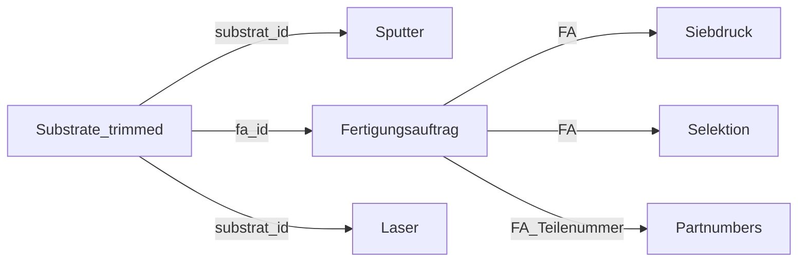

# Data Preprocessing & Sensor Grouping Specification

## 1. Multi-Table Relational Data Joining

The raw manufacturing dataset spans multiple operational tables. Preprocessing enforces exact relational joins to assemble clean production order timelines:



1. **Substrate $\rightarrow$ Sputter**: Inner join on `substrat_id`.
2. **Substrate $\rightarrow$ Fertigungsauftrag**: Inner join on `fa_id` (imputing or filtering rows with missing production order links where `fa_id = -1`).
3. **Substrate $\rightarrow$ Laser**: Inner join on `substrat_id`.
4. **Fertigungsauftrag $\rightarrow$ Siebdruck & Selektion**: Joined via order number `FA`.
5. **Fertigungsauftrag $\rightarrow$ Partnumbers**: Joined via `FA_Teilenummer`.

---

## 2. Feature Engineering & Physical Transformations

### A. Seasonal Binary Encoding
Cleanroom humidity (`DS_LF`) and ambient temperature vary across seasons, directly impacting paste drying rates. Datestamps are encoded into seasonal indicators:
$$\text{Month} \in \{12, 1, 2\} \implies \text{Winter}, \quad \{3, 4, 5\} \implies \text{Spring}, \quad \{6, 7, 8\} \implies \text{Summer}, \quad \{9, 10, 11\} \implies \text{Autumn}$$

### B. Rolling Historical Lag Features
Because screen printing paste lot IDs are unknown at the laser table, the pipeline calculates rolling mean lag features across the 5 most recent finished orders per sensor group:
- `lag_mean_tk_n_avg_5`: Rolling average temperature coefficient ($TCR$) shift.
- `lag_mean_r0_shift_5`: Rolling average $R_0$ resistance shift.

### C. Physical $R_0$ Calculation
The pre-trim resistance at 0 °C ($R_{0,\text{pt}}$) is calculated from the $20\ ^\circ\text{C}$ measurement ($R_{20}$) and sputtering TCR ($\alpha = \text{TCR} \cdot 10^{-3}\ \text{K}^{-1}$):
$$R_{0,\text{pt}} = \frac{R_{20,\text{pt}}}{1 + 20 \cdot \alpha}$$

---

## 3. Sensor Grouping Specification (The 12 Groups)

### Motivation
The raw `sensortyp` column contains over **73 distinct categories**, many with fewer than 15 total production occurrences. Training directly on these raw strings causes overfitting and high dimensionality. 

By parsing sensor designation strings:
$$\text{[Type]} \quad 1.\text{[Geometry]}.\text{[ResistanceCode]} \quad \text{[Additional Details]}$$

We consolidate all 73+ rare sensor designations into **12 primary physical groups**:

| Group | Type | Resistance Code | Pt Sensor Type | Historical Samples | Representative Sensors |
|---|---|---|---|---|---|
| **Group 1** | `PCS` | `5` | Pt500 | 6,850 | `PCS 1.1503.5`, `PCS 1.1302.5` |
| **Group 2** | `PCS` | `10` | Pt1000 | 6,689 | `PCS 1.1503.10`, `PCS 1.1302.10M` |
| **Group 3** | `PCA` | `10` | Pt1000 | 8,367 | `PCA 1.2005.10S 10`, `PCA 1.4005.10M 18` |
| **Group 4** | `PCA` | `1` | Pt100 | 8,247 | `PCA 1.2005.1S 10`, `PCA 1.2003.1S 10` |
| **Group 5** | `PCS` | `1` | Pt100 | 1,551 | `PCS 1.1503.1`, `PCS 1.1302.1M` |
| **Group 6** | `PCS` | `7` | Pt700 | 502 | `PCS 1.1503.07` |
| **Group 7** | `PCA` | `5` | Pt500 | 543 | `PCA 1.2005.5S 10`, `PCA 1.1505.5M 10` |
| **Group 8** | `PCKL` | `10` | Pt1000 | 298 | `PCKL 1.4005.10 9.2` |
| **Group 9** | `PCKL` | `1` | Pt100 | 84 | `PCKL 1.4005.1 9.2` |
| **Group 10** | `PCA` | `20` | Pt2000 | 24 | `PCA 1.2010.20S 10` |
| **Group 11** | `PCF` | `5` | Pt500 | 14 | `PCF 1.1302.5` |
| **Group 12** | `PCF` | `10` | Pt1000 | 12 | `PCF 1.1302.10` |

---

## 4. Screening Printing Fallback Logic

When operators omit optional screen printing inputs (`ds1_viscosity`, `ds2_viscosity`, `air_humidity`) during inference, the API calculates fallback values dynamically from historical database records using SQL aggregation:

```python
avg_ds1 = db.query(func.avg(HistoricalOrder.ds1_viscosity)).scalar()  # Default ~12.36 Pa·s
avg_ds2 = db.query(func.avg(HistoricalOrder.ds2_viscosity)).scalar()  # Default ~14.02 Pa·s
avg_humidity = db.query(func.avg(HistoricalOrder.air_humidity)).scalar()  # Default ~44.32%
```
