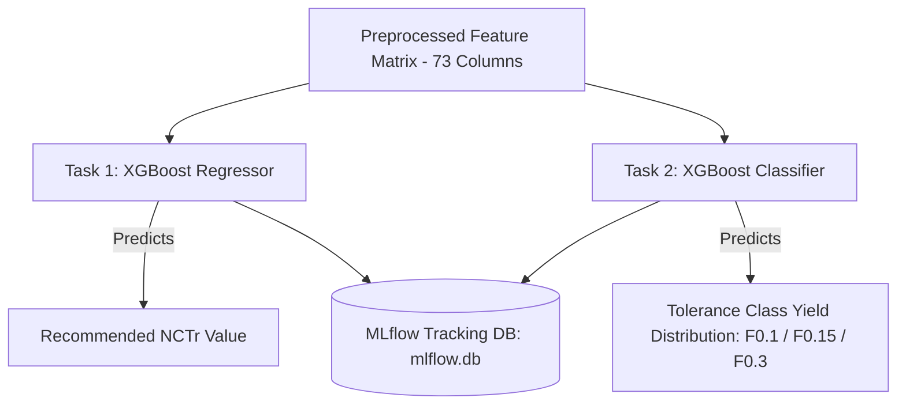

# Machine Learning Modeling & Validation Results

## 1. Chronological Target Realignment ($NCTr$)

The primary machine learning objective is predicting the **Nominal Value Correction ($NC$)** for laser trimming. 

Sensors can be trimmed in a single pass or via an optional intermediate coarse/fine adjustment step ($NT$ step). Physical evaluation of cleanroom procedures indicates that if an $NT$ step is executed, the initial nominal correction value is overwritten. The target variable was therefore realigned to **$NCTr$**, taking the last valid measurement recorded in the cleanroom:

$$NCTr = N\_NOMINALVALUECORRECTION \longrightarrow NT\_NOMINALVALUECORRECTION \longrightarrow NOMINALVALUECORRECTION$$

> [!IMPORTANT]
> Realigning the training target to $NCTr$ dropped the regression **RMSE from 0.1044 down to 0.0202**, representing a **5-fold improvement in prediction accuracy**.

---

## 2. Model Architecture & Training Strategy

Two specialized XGBoost models were developed and tuned via Optuna hyperparameter optimization:

1. **Task 1 (Regression)**: Predicts continuous $NCTr$ values to set laser trimming parameters.
2. **Task 2 (Classification)**: Predicts final sensor yield across standardized tolerance classes (**F 0.1**, **F 0.15**, **F 0.3**).
3. **Data Splitting**: Train/Test splits (80/20) were stratified by `sensor_group_key` to ensure rare sensor types are representatively distributed across folds.

---

## 3. Comprehensive Model Validation Results

### Task 1: $NCTr$ Regression Validation Performance

| Metric | Target Value | Baseline Linear Model | Optimized XGBoost Regressor |
|---|---|---|---|
| **Root Mean Squared Error (RMSE)** | Lower is better | 0.1044 | **0.0202** |
| **Mean Absolute Error (MAE)** | Lower is better | 0.0712 | **0.0125** |
| **Coefficient of Determination ($R^2$)** | Higher is better (max 1.0) | 0.7120 | **0.9492** |
| **% Within $\pm 0.1$ Tolerance** | Higher is better (max 100%) | 82.40% | **99.63%** |

> [!TIP]
> **99.63% of predictions fall within $\pm 0.1$ units of actual corrections**, satisfying strict industrial quality standards.

### Task 2: Yield Tolerance Class Classification Performance

| Metric | Multi-Class Classification Performance |
|---|---|
| **Accuracy** | **94.52%** |
| **Precision (Weighted)** | **94.49%** |
| **Recall (Weighted)** | **94.52%** |
| **F1-Score (Weighted)** | **0.9440** |

---

## 4. EU AI Act & VDE SPEC 90012 Trustworthy AI Compliance

To comply with VDE SPEC 90012 and EU AI Act transparency requirements (effective August 2026 for high-risk industrial AI decision tools), the serving layer implements automated compliance controls:

1. **Model Traceability**:
   Each serialized model checkpoint stores the active MLflow `run_id` (e.g. `fe5c8e4ab24f4dbf92d441f88afe14c6`). Every API inference response embeds this `model_version` and logs it to SQLite history for auditability.
2. **AI Transparency Disclaimers**:
   All API prediction responses include:
   - `is_ai_generated`: `true`
   - `compliance_disclaimer`: *"This prediction is generated by an AI machine learning model trained on historical laser trimming orders and is subject to human verification under EU AI Act transparency requirements."*
